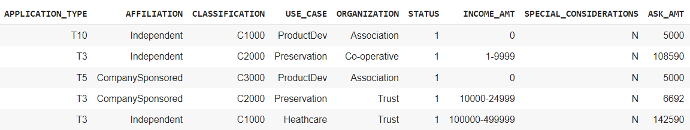
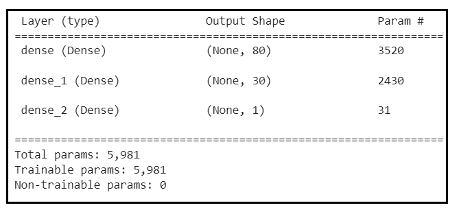
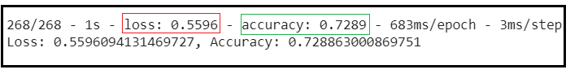
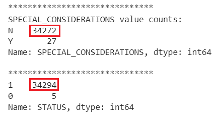
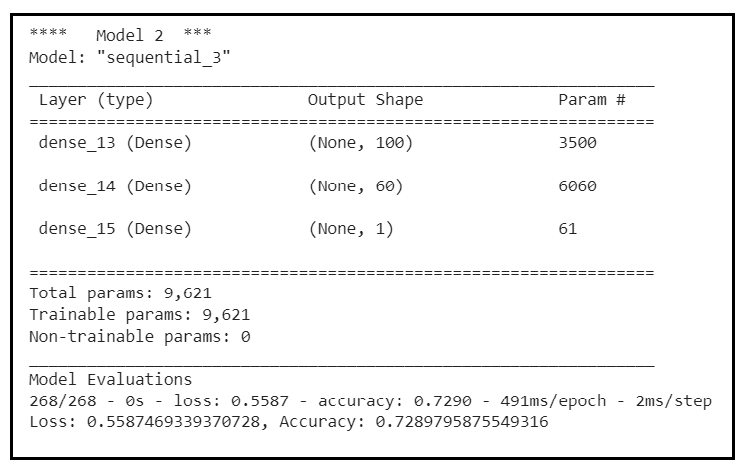
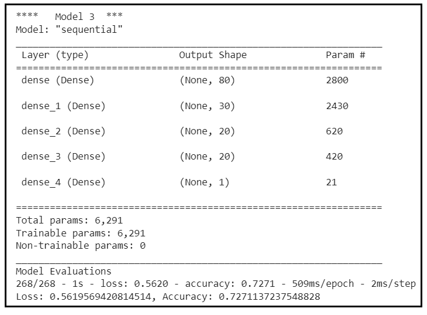
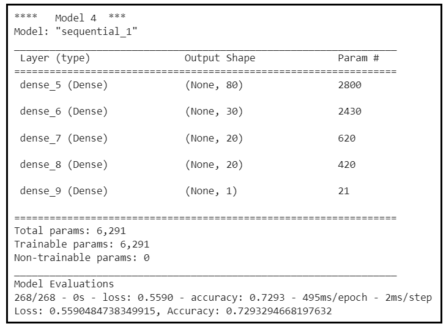
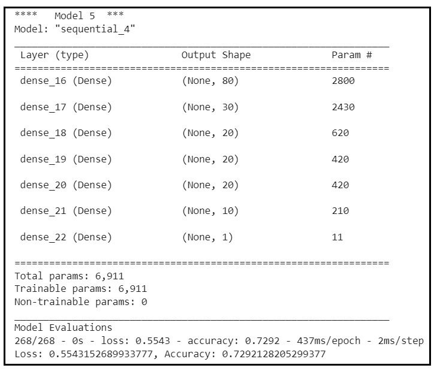
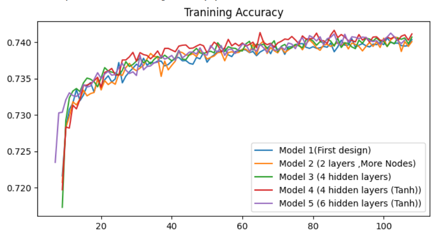
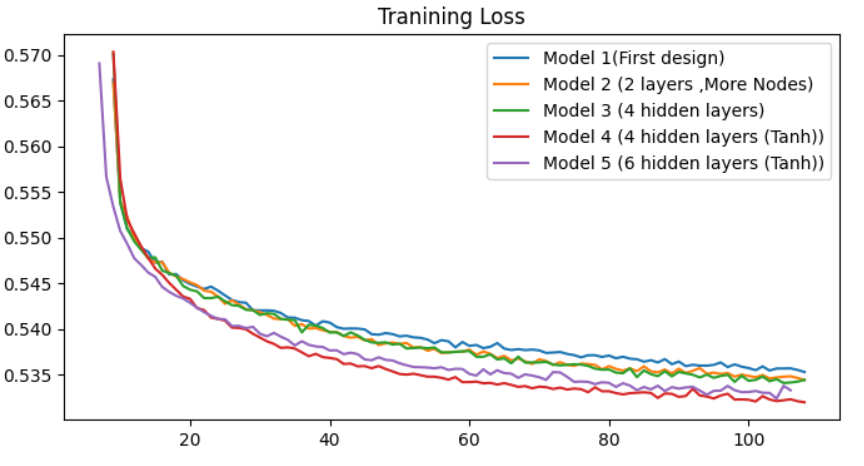

# deep-learning-challenge
 Here ,using machine learning and neural networks, we want to select the applicants for funding with the best chance of success in their ventures. We create a binary classification model that can predict if a funded organization will be successful based on the features in the dataset
The resource file contains more than 34,000 organizations that have received funding over the years. 

## Data Analysis
Within this dataset are a number of columns that capture metadata about each organization, such as:
- EIN and NAME—Identification columns
- APPLICATION_TYPE—Alphabet Soup application type
- AFFILIATION—Affiliated sector of industry
- CLASSIFICATION—Government organization classification
- USE_CASE—Use case for funding
- ORGANIZATION—Organization type
- STATUS—Active status
- INCOME_AMT—Income classification
- SPECIAL_CONSIDERATIONS—Special considerations for application
- ASK_AMT—Funding amount requested
- IS_SUCCESSFUL—Was the money used effectively

All columns except EIN, NAME, and IS_SUCCESSFUL are used as features(shown in the following table). 'IS_SUCCESSFUL' is used as the target for our classifier model. It has 1, and 0 values which are used to classify applicants into two different groups. Looking at the total numbers of different classes (1: 18261,  0 :16038), we can assume that training data is balanced.

## Machine Learning Process
> ### Preprocessing: 

To prepare data for training, first we need to clean and scale it. By looking at the number of unique values of categorical columns with more than 10 unique values, we regroup "rare" categorical variables together in a new value (‘other’). Next we encode all categorical variables.
The final step is scaling data using StandardScaler.

> ### Compile, Train, and Evaluate the Model

After cleaning and encoding the categorical variables, we have 43 features to use as inputs for our neural network model. The very first model is designed as shown in the following Figure (input nodes: 43, first layer nodes:80, second layer nodes:30, output node:1). Activation function for Input and hidden layers is ‘relu’ and for the output layer is ‘sigmoid’.
Parameters used to fit the models are: batch_size=20, epochs=100. We also create a callback that saves the model's weights every five epochs. The final results are saved and exported to an HDF5 file (AlphabetSoupCharity.h5).

The evaluation on test data is as follows: 

## Optimize the Model
To Optimize the model we take following steps:

> Dropping 'STATUS',  'SPECIAL_CONSIDERATIONS' columns:

These two columns mostly have a single value, which makes them less useful for our training. They only add more complexities with not much information.
The same model, defined in the last section, applied. 

> Adding more nodes (Model_2):

The new model is designed as shown in the following image. The number of nodes increases without adding more layers. The training was slower and there were not much differences in the results.

> Adding more layers:

Here we modify the first design by adding more layers.Model and results shown in the following.

> Adding more layers and changing activation to ‘tanh’:

> Adding more layers to Model_5:

Following images show the training accuracy and training loss for the models explained above. In all models, there are a lot of fluctuations in the accuracy curve. From the graph, Model_4 shows a slightly better accuracy and loss compared to other models.  We added more layers to Model_4 to see if adding more layers is going to improve the model(Model_5). From the graph Model_4 shows a slightly better performance over the other models. From the evaluation results on test data, Model_4 and Model_5 are showing the same accuracy while Model_5 has more layers and added more complexities to the model.   

## Summary
We created a NN model to predict if a funded organization will be successful based on some organization’s features. We created a base model and then tried to optimize it by adding more nodes,more hidden layers , different activation functions and the combination of those. We compared the evaluation results and the training accuracy and loss for five different designs. Adding more layers and changing the activation function shows improvement(Model_4). However, when we added more layers to Model_4 (Model_5), we did not see any visible improvement. The best model here is Model_4 with the following summary:
    

